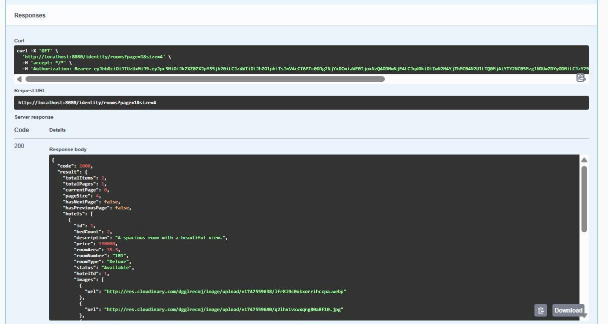

# Hotel Booking Backend

This is the **Backend** project for the hotel booking website.

---

## 📅 Timeline & Progress

### 14/04 - 20/04/2025
- Designed the **database schema**:
  
---

### 21/04 - 27/04/2025
- Developed API endpoints for:
    - **User login**
      
    - **User registration**
      
    - **Google authentication**
    - **User logout**
---

### 28/04 - 04/05/2025
- Built API endpoints for hotel management:
    - **Retrieve all hotels**
    - **Filter hotels** by criteria (e.g., price, category, Name)
    - **Search hotels** by destination
      
    - GetUserInformation
      
    - **Create Hotel**
### 05/05 - 11/05/2025
- Built API endpoints for getDetailHotel
  - Implemented the endpoint GET /hotels/{hotelId} to retrieve detailed information of a specific hotel.

  - This endpoint returns a structured ApiResponse<HotelResponse> containing the full detail of the hotel entity, including images, location, price, and category.

  - Integrated the endpoint with service layer hotelServiceImp.getOneHotel(hotelId) to encapsulate business logic and database interaction.

  - Ensured the endpoint is RESTful and supports standard HTTP status codes for success and failure scenarios.
- Handle Exception!!
  - Create a custom exception that includes predefined error codes.
    
### 12/05 - 18/05/2025
  - Built VNPAY Payment API to handle payment transactions.
    Integrated Email Sending functionality using Brevo (formerly Sendinblue).
   
   
  - Work:
    Created endpoints to initiate and verify VNPAY payments.
    Sent booking confirmation emails to users upon successful transactions via Brevo SMTP.
    
### 19/05 - 25/05/2025
  - Developed Comment API for users to post and fetch reviews on hotels.
  - Implemented Related Hotels API, recommending hotels based on category, location, or rating.
  - Built Profile Management API allowing users to retrieve and update their profile information.
### 26/05 - 01/06/2025
  - API List Hotel with pagination and search params
    
  - API Create Hotel with cloudinary
    
  - Edit hotel API is similar to create Hotel API, but will get information by Hotel ID
### 02/06 - 08/06/2025
- API List Room with params
  
- API Create Room with cloudinary
  
- API Edit Room
  
- Room APIS
  
---

## 🚀 Technologies Used
- Spring Boot
- Java 21
- MySQL
- JWT Authentication
- OAuth 2.0 (Google Sign-In)
- Maven
- Apache TomCat
---

